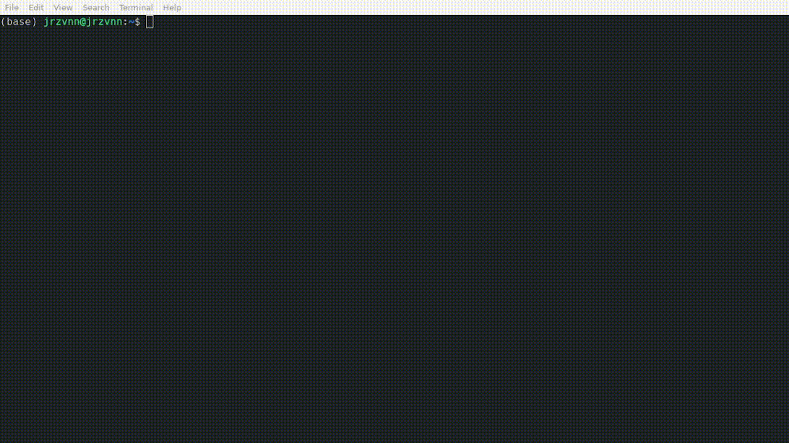

# 🃏 Jrzvnn npx Card 

This npx card is a simple command-line tool that displays a customizable business card in your terminal.



## 📦 Installation

Installation is not required, as you can run this package with [`npx`](https://npmjs.com/package/npx).

## 🥑 Usage
```bash
npx jrzvnn
```


## 🕺🏼 Customization

First, [fork][fork] this repository, clone it your machine, and install the dependencies.

```bash
git clone https://github.com/jrzvnn/npx-card.git
cd npx-card
npm install
```

Next, you can customize your business card by providing additional options as command-line arguments. Here are some available options:

- `--name`: Specify your name.
- `--title`: Specify your job title or role.
- `--email`: Specify your email address.
- `--website`: Specify your website or portfolio URL.
- `--github`: Specify your GitHub username.
- `--twitter`: Specify your Twitter handle.
- `--linkedin`: Specify your LinkedIn profile URL.
- `--color`: Specify the color of the card. Supported values: red, green, blue, yellow, purple.
  
Then, update the `name` field in [`package.json`][package]. I highly recommend that the `name` field matches your primary online username (ex: `jrzvnn`).

Finally, [publish][publish] the package to `npm`. 
```bash
npm publish
```
Now anyone with `npm` installed can see your business card!

### ❔ Questions

🐛 report bugs by filing [issues][issues]  
📢 provide feedback with [issues][issues] 

## 🎞 Credit
*  This card is inspired by the one that @anmol098 created. Take a look to his [repo](https://github.com/anmol098/npx_card)


[issues]: https://github.com/jrzvnn/npx-card/fork
[package]: https://github.com/jrzvnn/npx-card/blob/main/package.json
[fork]: https://github.com/jrzvnn/npx-card/fork
[publish]: https://docs.npmjs.com/cli/v6/commands/npm-publish